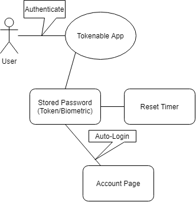

# Tokenable

## Project Abstract
This project is an application that serves as a password saver that will periodically remind the user to change their password for added security measures. The passwords that will be used are not ordinary text fields but stored images/biometrics accesed through the use of the a phones camera as a scanner. These 'tokens' are then used to to unlock the users synched accounts. Upon succesful 'scan' the user will be redirected to the specified account while logged in. 

## Project Relevance
The Educational Goals this project will cover include and are not limited to:
- Using OOD (Object Oriented Design)
- Using TDD (Test Driven Development)
- Debugging
- On-the-fly coding
- Access to database
- Using software development tools
- - Project Management
- - Version Control
- - Build
- - Test
- - Issue Tracking
- Experience working in small teams

## Conceptual Design
As this is a ground up project proposal, we will be starting from scratch. Functionality will be develped in pieces. Chosing 1 functionality at a time would enable a gradule process of development. The basics of this project consist of a login screen, accounts page, settings, and other smaller details that would be developed in time.

## Background
For detailed background information on this project, refrence [this](https://github.com/HunterLaut/IndividualProjectProposal/blob/master/test%20(1).pdf) document.
This project is a new startup. There is a basic prototype that simulates some its functionality.

***Test Case Document***    
Use [this](https://github.com/HunterLaut/IndividualProjectProposal/blob/master/TestCaseAssessmentHMC%20(3).pdf) document to perform tasks that give insight on using the application.

***Login credentials***
- *Username:* test@test.com
- *Password:* 12345678

***Prototype Link (designed in Axure)***:   
<https://ttzwy1.axshare.com>   

***Building***
- Chrome for prototype
- Netbeans 11 for developing code

**Running**
- Currently in development

## Required Resources
- _Group members competencies_
- _Hardware and software resource required_
- _Willingness to code from square one_
